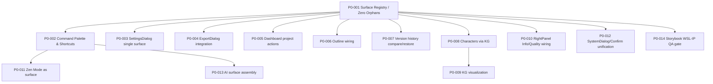

# Task Cards Index — CreoNow Frontend Full Assembly

> Spec：`openspec/specs/creonow-frontend-full-assembly/spec.md`

本索引用于把“前端完全体组装”拆解为可并行、可验收、PR 粒度合适的任务卡（P0/P1）。

## 全局约束（所有任务卡共用）

- 资产 SSOT：以 `design/01-asset-inventory-and-surface-map.md` 的 Inventory 为准（截至 2026-02-05：56/56；数量随 stories 变化），并受零孤儿门禁约束（见 `design/06-asset-completion-checklist.md`）。
- 快捷键：必须符合 `design/DESIGN_DECISIONS.md`（尤其：`Cmd/Ctrl+B` 保留加粗；侧边栏折叠 `Cmd/Ctrl+\\`；设置 `Cmd/Ctrl+,`）。
- IPC：必须返回 `{ ok: true|false }`，禁止 silent failure（见 `AGENTS.md`）。
- 验收：每个 PR 必须完成 Storybook WSL-IP 视觉/交互验收并在 RUN_LOG 留证（见 `design/04-qa-gates-storybook-wsl.md` 与 `design/08-test-and-qa-matrix.md`）。
- 测试：功能必须有测试；关键路径必须有边界/极限测试（见 `AGENTS.md`）。
- 单链路：同一能力不得出现两套入口/两套状态机（Settings/Export/Confirm/Zen/Compare）。
- 并行：按 `design/09-parallel-execution-and-conflict-matrix.md` 规避冲突（尤其：`ipc-contract.ts` 串行）。

---

## P0（必须）

1. `P0-001` Surface Registry + 零孤儿门禁（把 56 个 assets 全量映射；数量随 stories 变化）
   - Card: `task_cards/p0/P0-001-surface-registry-and-zero-orphans-gate.md`
   - Links: `spec.md#cnfa-req-001`, `design/01-asset-inventory-and-surface-map.md`, `design/02-navigation-and-surface-registry.md`
2. `P0-002` Command Palette：命令补齐 + 快捷键对齐
   - Card: `task_cards/p0/P0-002-command-palette-commands-and-shortcuts.md`
   - Links: `spec.md#cnfa-req-008`, `design/02-navigation-and-surface-registry.md`, `design/DESIGN_DECISIONS.md`
3. `P0-003` SettingsDialog 收敛为唯一 Settings Surface（吸收 SettingsPanel）
   - Card: `task_cards/p0/P0-003-settingsdialog-as-single-settings-surface.md`
   - Links: `spec.md#cnfa-req-010`, `design/02-navigation-and-surface-registry.md`, `design/03-ipc-reservations.md`
4. `P0-004` ExportDialog 组装（入口统一 + UNSUPPORTED 语义）
   - Card: `task_cards/p0/P0-004-exportdialog-integration-and-format-support.md`
   - Links: `spec.md#cnfa-req-007`, `design/03-ipc-reservations.md`
5. `P0-005` Dashboard 项目操作闭环 + 模板语义补齐
   - Card: `task_cards/p0/P0-005-dashboard-project-actions-and-templates.md`
   - Links: `spec.md#cnfa-req-004`, `design/03-ipc-reservations.md`
6. `P0-006` Outline：从编辑器派生 + 可导航
   - Card: `task_cards/p0/P0-006-outline-derived-from-editor-and-navigate.md`
   - Links: `spec.md#cnfa-req-005`, `spec.md#cnfa-req-003`
7. `P0-007` Version History：compare/diff/restore 完整闭环（含 `version:read`）
   - Card: `task_cards/p0/P0-007-version-history-compare-diff-restore.md`
   - Links: `spec.md#cnfa-req-006`, `design/03-ipc-reservations.md`
8. `P0-008` Characters：复用 Knowledge Graph 作为 SSOT（CRUD + relations）
   - Card: `task_cards/p0/P0-008-characters-via-knowledge-graph.md`
   - Links: `spec.md#cnfa-req-005`, `design/03-ipc-reservations.md`
9. `P0-009` Knowledge Graph 可视化组装（Graph view）
   - Card: `task_cards/p0/P0-009-knowledge-graph-visualization-assembly.md`
   - Links: `spec.md#cnfa-req-005`, `design/01-asset-inventory-and-surface-map.md`
10. `P0-010` RightPanel：Info/Quality 真接电（stats + judge/constraints）
   - Card: `task_cards/p0/P0-010-rightpanel-info-and-quality-wiring.md`
   - Links: `spec.md#cnfa-req-011`, `design/03-ipc-reservations.md`
11. `P0-011` Zen Mode：作为真实 surface（F11 + 命令面板）
   - Card: `task_cards/p0/P0-011-zen-mode-as-real-surface.md`
   - Links: `spec.md#cnfa-req-009`, `design/02-navigation-and-surface-registry.md`
12. `P0-012` AiDialogs/SystemDialog：统一确认与错误 UI（替换 window.confirm）
   - Card: `task_cards/p0/P0-012-aidialogs-systemdialog-and-confirm-unification.md`
   - Links: `spec.md#cnfa-req-003`, `design/02-navigation-and-surface-registry.md`
13. `P0-013` AI Surface 组装与可观测性（消除占位交互）
   - Card: `task_cards/p0/P0-013-ai-surface-assembly-and-observability.md`
   - Links: `spec.md#cnfa-req-012`, `design/04-qa-gates-storybook-wsl.md`
14. `P0-014` Storybook WSL-IP QA Gate（流程固化 + 证据格式）
   - Card: `task_cards/p0/P0-014-storybook-wsl-ip-qa-gate.md`
   - Links: `spec.md#cnfa-req-012`, `design/04-qa-gates-storybook-wsl.md`

---

## P1（建议）

1. `P1-001` Project 元数据（描述/封面）持久化与展示
   - Card: `task_cards/p1/P1-001-project-metadata-description-cover.md`
2. `P1-002` Export PDF/DOCX 真支持（非 UNSUPPORTED）
   - Card: `task_cards/p1/P1-002-export-pdf-docx-implementation.md`

---

## Dependencies（P0 依赖图）

