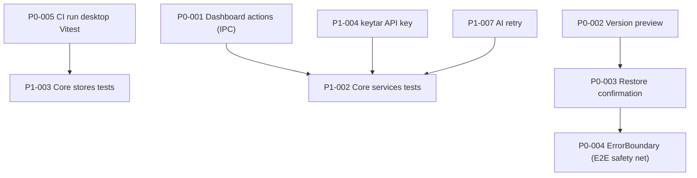

# Task Cards Index — CreoNow MVP Readiness Remediation

> Spec：`openspec/specs/creonow-mvp-readiness-remediation/spec.md`
>
> Design map：`openspec/specs/creonow-mvp-readiness-remediation/design/01-delta-map.md`

本索引把审评报告的 todos 拆解为可并行、可验收、PR 粒度合适的任务卡（P0/P1/P2）。

## 全局约束（所有任务卡共用）

- 宪法：`AGENTS.md`（IPC `{ ok: true|false }`、禁止 silent failure、必须有测试、显式依赖注入）。
- 设计：`design/system/README.md` + `design/system/01-tokens.css` + `design/DESIGN_DECISIONS.md`（token/间距/字体/交互不可偏移）。
- 关联规范：`openspec/specs/creonow-frontend-full-assembly/spec.md`（仅作为上游背景；本 spec 为 delta SSOT）。
- IPC：任何新增/修改通道必须更新 codegen（`pnpm contract:generate`）且带最小测试覆盖。
- 并行：`ipc-contract.ts` + `ipc-generated.ts` 必须串行（见 `design/09-parallel-execution-and-conflict-matrix.md`）。
- 证据：关键命令与关键输出必须写入 RUN_LOG（`openspec/_ops/task_runs/ISSUE-<N>.md`；Runs 只追加不回写）。

---

## P0（必须：MVP 闭环）

1. `P0-001` Dashboard 项目操作闭环：rename/duplicate/archive（阻塞项）
   - Card: `task_cards/p0/P0-001-dashboard-project-actions-rename-duplicate-archive.md`
   - Links: `spec.md#cnmvp-req-001`, `design/02-dashboard-project-actions.md`
2. `P0-002` Version History Preview：只读预览 Dialog
   - Card: `task_cards/p0/P0-002-version-history-preview-dialog.md`
   - Links: `spec.md#cnmvp-req-002`, `design/03-version-preview-and-restore-confirm.md`
3. `P0-003` Restore 确认统一：SystemDialog（两处入口）
   - Card: `task_cards/p0/P0-003-version-restore-confirmation-systemdialog.md`
   - Links: `spec.md#cnmvp-req-003`, `design/03-version-preview-and-restore-confirm.md`
4. `P0-004` React ErrorBoundary：防白屏 + 可恢复
   - Card: `task_cards/p0/P0-004-react-error-boundary.md`
   - Links: `spec.md#cnmvp-req-004`, `design/04-error-boundary-and-crash-recovery.md`
5. `P0-005` CI：运行 desktop Vitest（renderer 组件/Store）
   - Card: `task_cards/p0/P0-005-ci-run-desktop-vitest.md`
   - Links: `spec.md#cnmvp-req-005`, `design/05-test-strategy-and-ci.md`

---

## P1（建议：质量/安全/架构加固）

1. `P1-001` AI History：移除 MOCK_HISTORY，真实聊天历史切换
   - Card: `task_cards/p1/P1-001-ai-history-real-data.md`
2. `P1-002` Core services 单元测试（project/document/kg/ai）
   - Card: `task_cards/p1/P1-002-core-services-unit-tests.md`
3. `P1-003` Core stores 测试（Vitest）
   - Card: `task_cards/p1/P1-003-core-stores-tests.md`
4. `P1-004` 安全：keytar 加密存储 API Key（含迁移）
   - Card: `task_cards/p1/P1-004-keytar-secure-api-key-storage.md`
5. `P1-005` 安全：XSS 防护（sanitize 或移除 innerHTML）
   - Card: `task_cards/p1/P1-005-xss-hardening-sanitize-html.md`
6. `P1-006` 架构：消除 projectId/documentId 冗余（SSOT）
   - Card: `task_cards/p1/P1-006-state-ssot-remove-project-document-id-redundancy.md`
7. `P1-007` 功能：AI 请求重试（429、5xx 指数退避）
   - Card: `task_cards/p1/P1-007-ai-retry-backoff.md`

---

## P2（可选：性能/代码质量）

1. `P2-001` React.memo：高频列表项
   - Card: `task_cards/p2/P2-001-react-memo-list-items.md`
2. `P2-002` 虚拟化：Outline/VersionHistory/CommandPalette/SearchPanel
   - Card: `task_cards/p2/P2-002-virtualize-large-lists.md`
3. `P2-003` Zustand useShallow：选择器优化
   - Card: `task_cards/p2/P2-003-zustand-useShallow-audit.md`
4. `P2-004` console 清理 + logger 收敛
   - Card: `task_cards/p2/P2-004-console-cleanup-and-logger.md`
5. `P2-005` UI strings 常量化（为 i18n 预留结构）
   - Card: `task_cards/p2/P2-005-ui-strings-constants.md`

---

## Dependencies（最小依赖图）

