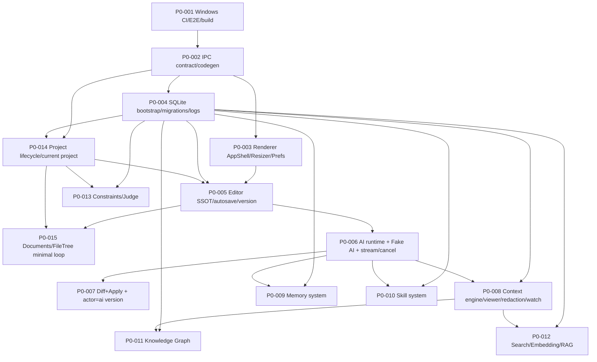

# Task Cards Index — CreoNow V1 Workbench

> Spec：`openspec/specs/creonow-v1-workbench/spec.md`

本索引用于把 `creonow-v1-workbench` 的实现拆解为可并行、可验收、PR 粒度合适的任务卡（P0/P1）。

## 全局约束（所有任务卡共用）

- Windows-first：P0 相关 PR 必须在 `windows-latest` 跑通 Playwright Electron E2E（见 `CNWB-REQ-001`）。
- IPC：所有通道必须返回 `{ ok: true|false }`，错误码稳定可测（见 `CNWB-REQ-040`）。
- Fake-first：AI 相关 E2E 禁止依赖真实网络与真实 key（见 `CNWB-REQ-050`）。
- UI：关键路径必须提供稳定 `data-testid`（见 `design/01-frontend-implementation.md`）。

---

## P0（必须）

1. `P0-001` Windows CI + Windows E2E + build artifacts
   - Card: `task_cards/p0/P0-001-windows-ci-windows-e2e-build-artifacts.md`
   - Links: `CNWB-REQ-001`, `design/10-windows-build-and-e2e.md`
2. `P0-002` IPC contract SSOT + codegen + typed invoke gate
   - Card: `task_cards/p0/P0-002-ipc-contract-ssot-and-codegen.md`
   - Links: `CNWB-REQ-040`, `design/03-ipc-contract-and-errors.md`
3. `P0-003` Renderer 基础工程：tokens + AppShell/Resizer + PreferenceStore
   - Card: `task_cards/p0/P0-003-renderer-design-tokens-appshell-resizer-preferences.md`
   - Links: `CNWB-REQ-010`, `design/01-frontend-implementation.md`
4. `P0-004` SQLite bootstrap + migrations + logs（Windows 可观测）
   - Card: `task_cards/p0/P0-004-sqlite-bootstrap-migrations-logs.md`
   - Links: `CNWB-REQ-001`, `CNWB-REQ-120`, `design/10-windows-build-and-e2e.md`
5. `P0-014` Project lifecycle + current project（入口与可重复 E2E）
   - Card: `task_cards/p0/P0-014-project-lifecycle-and-current-project.md`
   - Links: `CNWB-REQ-005`, `design/11-project-and-documents.md`
6. `P0-005` Editor SSOT + autosave + versioning（actor=user/auto）
   - Card: `task_cards/p0/P0-005-editor-ssot-autosave-versioning.md`
   - Links: `CNWB-REQ-020/030`, `design/02-document-model-ssot.md`
7. `P0-015` Documents + FileTree minimal loop（create/switch/rename/delete）
   - Card: `task_cards/p0/P0-015-documents-and-filetree-minimal.md`
   - Links: `CNWB-REQ-006`, `design/11-project-and-documents.md`, `design/01-frontend-implementation.md`
8. `P0-006` AI runtime + Fake AI server + stream/cancel/timeout
   - Card: `task_cards/p0/P0-006-ai-runtime-fake-provider-stream-cancel-timeout.md`
   - Links: `CNWB-REQ-050`, `design/09-ai-runtime-and-network.md`
9. `P0-007` AI diff + apply（选区替换）+ actor=ai 版本
   - Card: `task_cards/p0/P0-007-ai-diff-and-apply-selection-version-ai.md`
   - Links: `CNWB-REQ-030/050`, `design/02-document-model-ssot.md`
10. `P0-008` Context engineering + viewer + redaction + watch `.creonow`

- Card: `task_cards/p0/P0-008-context-engineering-viewer-redaction-watch.md`
- Links: `CNWB-REQ-060`, `design/04-context-engineering.md`

11. `P0-009` Memory：CRUD + settings + injection preview + preference learning

- Card: `task_cards/p0/P0-009-memory-crud-injection-preview-preference-learning.md`
- Links: `CNWB-REQ-070`, `design/05-memory-system.md`

12. `P0-010` Skills：package loader + validator + list/toggle + UI 入口

- Card: `task_cards/p0/P0-010-skill-system-packages-validator-ui.md`
- Links: `CNWB-REQ-080`, `design/06-skill-system.md`

13. `P0-011` Knowledge Graph：CRUD + UI + context integration

- Card: `task_cards/p0/P0-011-knowledge-graph-crud-ui-context.md`
- Links: `CNWB-REQ-090`, `design/08-knowledge-graph.md`

14. `P0-012` Search/Embedding/RAG：FTS + retrieve + fallback（Windows-first）

- Card: `task_cards/p0/P0-012-search-embedding-rag-minimal-fallback.md`
- Links: `CNWB-REQ-100`, `design/07-search-embedding-rag.md`

15. `P0-013` Constraints/Judge：最小可用 + Windows 可测降级

- Card: `task_cards/p0/P0-013-constraints-and-judge-minimal.md`
- Links: `CNWB-REQ-110`, `spec.md`

---

## P1（建议）

1. `P1-001` Light theme（不进入 V1 关键路径）
   - Card: `task_cards/p1/P1-001-light-theme.md`
2. `P1-002` Analytics & Writing Stats
   - Card: `task_cards/p1/P1-002-analytics-and-writing-stats.md`
3. `P1-003` Export（markdown/pdf/docx）
   - Card: `task_cards/p1/P1-003-export-markdown-pdf-docx.md`
4. `P1-004` User memory semantic recall（`user_memory_vec`）
   - Card: `task_cards/p1/P1-004-user-memory-semantic-recall.md`
5. `P1-005` LiteLLM proxy（可选，默认关闭）
   - Card: `task_cards/p1/P1-005-litellm-proxy-optional.md`

---

## Dependencies（P0 依赖图）

